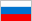
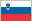

# Internationalization for Julia

You're encouraged to translate Julia's Documents into your native language. 

In the following tabel, (U) stands for translation in this language is unavailable at the moment.

    <table cellspacing="0" cellpadding="0" align="center">

    <tr>
    <td width="20%" height="70"> Albanian (U)</td>
    <td width="20%" height="70"> Arabic (U)</td>
    <td width="20%" height="70"> Argentine Spanish (U)</td>
    <td width="20%" height="70"> Azerbaijani (U)</td>
    </tr><tr>
    <td width="20%" height="70"> Belarusian (U)</td>
    <td width="20%" height="70"> Bosnian (U)</td>
    <td width="20%" height="70"> Brazilien Portuguese (U)</td>
    <td width="20%" height="70"> Bulgarian (U)</td>
    </tr><tr>
    <td width="20%" height="70"> Chinese Simplified</td>
    <td width="20%" height="70"> Croatian (U)</td>
    <td width="20%" height="70"> Czech (U)</td>
    <td width="20%" height="70"> Danish (U)</td>
    </tr><tr>
    <td width="20%" height="70"> Dutch (U)</td>
    <td width="20%" height="70"> Esperanto (U)</td>
    <td width="20%" height="70"> Farsi (U)</td>
    <td width="20%" height="70"> Finnish (U)</td>
    </tr><tr>
    <td width="20%" height="70"> French (U)</td>
    <td width="20%" height="70"> Georgian (U)</td>
    <td width="20%" height="70"> German (U)</td>
    <td width="20%" height="70"> Greek (U)</td>
    </tr><tr>
    <td width="20%" height="70"> Hebrew (U)</td>
    <td width="20%" height="70"> Hindi (U)</td>
    <td width="20%" height="70"> Hungarian (U)</td>
    <td width="20%" height="70"> Indonesian (U)</td>
    </tr><tr>
    <td width="20%" height="70"> Italian (U)</td>
    <td width="20%" height="70"> Japanese (U)</td>
    <td width="20%" height="70"> Kazakh (U)</td>
    <td width="20%" height="70"> Korean (U)</td>
    </tr><tr>
    <td width="20%" height="70"> Kyrgyz (U)</td>
    <td width="20%" height="70"> Latvian (U)</td>
    <td width="20%" height="70"> Lithuanian (U)</td>
    <td width="20%" height="70"> Macedonian (U)</td>
    </tr><tr>
    <td width="20%" height="70"> Malay (U)</td>
    <td width="20%" height="70"> Nynorsk (U)</td>
    <td width="20%" height="70"> Polish (U)</td>
    <td width="20%" height="70"> Portuguese (U)</td>
    </tr><tr>
    <td width="20%" height="70"> Romanian (U)</td>
    <td width="20%" height="70"> Russian (U)</td>
    <td width="20%" height="70"> Serbian (U)</td>
    <td width="20%" height="70"> Slovak (U)</td>
    </tr><tr>
    <td width="20%" height="70"> Slovenian (U)</td>
    <td width="20%" height="70"> Spanish (U)</td>
    <td width="20%" height="70"> Swedish (U)</td>
    <td width="20%" height="70"> Tagalog (U)</td>
    </tr><tr>
    <td width="20%" height="70"> Thai (U)</td>
    <td width="20%" height="70"> Turkish (U)</td>
    <td width="20%" height="70"> Ukrainian (U)</td>
    <td width="20%" height="70"> Uzbek (U)</td>
    </tr>

    </table>

